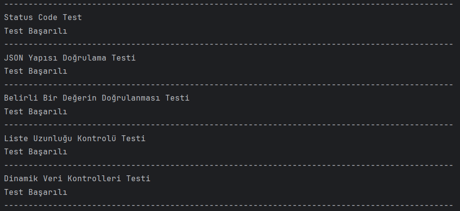

# Test Automation Exercise 🚀🚀

## Akakce UI Test  
*(IntelliJ IDEA 2024.1.4 ile Java kullanılarak geliştirilmiştir.)*

Bu proje, **Akakce.com** web sitesi üzerinde otomatik testler gerçekleştirerek temel kullanıcı senaryolarını doğrulamayı amaçlamaktadır.  

### Test Senaryosu
[AkakceUiTest](/src/test/java/AkakceUiTest) klasöründe yer alan `AkakceUiTest.java` dosyasında bulunan test senaryosu aşağıdaki adımları içerir:

1. Kullanıcı, **Akakce.com** üzerinde oturum açar.  
2. **iPhone** ürünlerini aratır ve listeler.  
3. İlk çıkan ürünü seçer.  
4. Seçtiği ürünü **takip listesine** ekler.  

> **Not:** `testAddFollowList` fonksiyonu içerisindeki `"userName"` ve `"userPassword"` değerleri, geçerli giriş bilgileri ile değiştirilmelidir.

---

## Postman API Test  
Bu proje, **restful-booker.herokuapp.com/apidoc/index.html** web sitesine ait API uç noktalarını test etmek amacıyla Postman kullanılarak oluşturulmuştur. 

- API uç noktalarına yapılacak her çağrı için bir test yazılmıştır.
- [RestfulBookerPostmanApiTest](/RestfulBookerPostmanApiTest) klasöründe Postman Collection ve test sonuçları JSON formatında bulunmaktadır.

---

## Rest Assured Test  
*(IntelliJ IDEA 2024.1.4 ile Java kullanılarak geliştirilmiştir.)*

Bu proje, **jsonplaceholder.typicode.com** web sitesinin `/posts` endpoint’i üzerinde aşağıdaki testleri gerçekleştirmektedir:

1. **JSON Yapısı Doğrulama Testi**  
2. **Belirli Bir Değerin Doğrulanması Testi**  
3. **Liste Uzunluğu Kontrolü Testi**  
4. **Dinamik Veri Kontrolleri Testi**  

Testi çalıştırmak için [RestAssuredTest](/src/test/java/RestAssuredTest) klasöründeki `RestAssuredTest.java` dosyası çalıştırılmalıdır.  

**Konsol Çıktısı:**  

---

## Manuel Test Case Çalışması  
Bu projede, **Akakce.com** web sitesinin **"Takip Listem"** özelliği için manuel test senaryoları hazırlanmıştır.  

- [ManuelTestCases](/ManuelTestCases) klasöründe yazılan test senaryoları **.pdf formatında** yer almaktadır.

---

